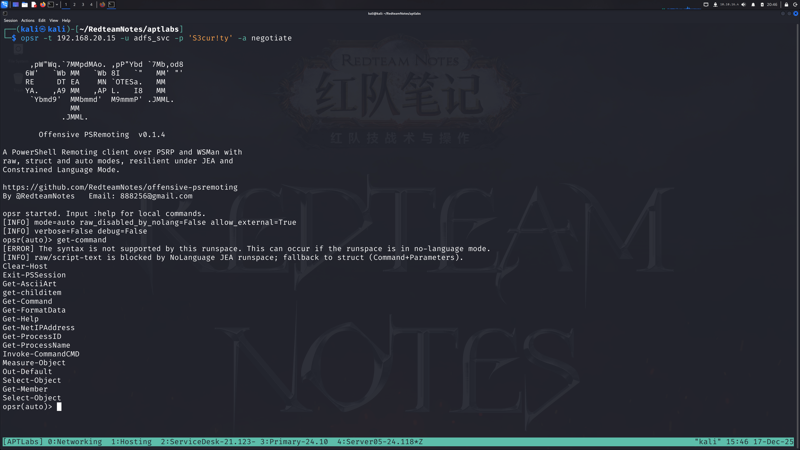

# Offensive PSRemoting

一个基于 **PSRP/WSMan（WinRM）** 的交互式 PowerShell Remoting REPL 客户端，提供 `raw / struct / auto` 三种执行模式，便于在不同受限环境下进行更稳定的远程交互、命令枚举与排错。

因为Powershell的JEA或受限语言模式下，Evil-WinRM使用受限；因依赖库版本等问题，Kali中又经常无法正常使用Powershell Remoting技术，所以有了这个工具。

Offensive PSRemoting 是一个易于在 Linux 中使用的 WinRM、PowerShell Remoting 交互式客户端。它基于 PSRP/WSMan 在远端维持 Runspace 会话，提供接近 Enter-PSSession 的交互体验；并提供结构化命令管道执行模式，在 JEA、NoLanguage 等受限端点下通常更稳定、可用性更强。

这里 REPL 客户端的核心价值，不在于绕过 WinRM、JEA 登录，而在于**在既定的远端策略与受限端点条件下，提升跨平台的连接一致性与交互可用性**。在 Windows 上，PowerShell 原生的 `Enter-PSSession / New-PSSession` 与系统内置的 Negotiate/Kerberos/WinRM 生态高度耦合，认证协商、票据处理、端点行为都更原生一致，可谓黄金客户端了；而在 Linux 下，PSRemoting/WinRM 的实现往往依赖更长的链路（`requests/urllib3 → pypsrp → pyspnego → gssapi/krb5`），任何一环的缺失或版本差异都可能表现为 401、协商失败、`No module named 'krb5'` 等问题，因此**Linux 场景对“可复现、可控、可诊断”的客户端更刚需**。

在能连上但不好用的端点环境里（例如 JEA、NoLanguage），问题通常不在认证本身，而在于**登录后的执行语义**：把整行当脚本文本发送（raw）需要远端 runspace 允许脚本语法解析；而结构化模式（struct）把输入拆成 **Cmdlet + Parameters** 的管道调用，等价于“调用被端点允许的命令并传参”，在 NoLanguage/受限 runspace 下通常更稳定。`auto` 模式的意义就是：先尝试 raw 以获得更接近原生的体验，一旦识别到 NoLanguage 语法限制导致失败，就自动回退到 struct，以保证在受限环境里依然能完成枚举、查询与排错工作。

因此，这个 REPL 的定位可以概括为：**面向 Linux 环境补齐原生 PowerShell Remoting 体验差距**，并在受限端点（JEA/NoLanguage）下通过结构化 PSRP 调用提升可用性；它不改变远端的授权边界与策略，只是用更“端点友好”的表达方式发起同样的远程调用，同时提供更清晰的参数化、调试与版本/依赖信息输出，便于比赛、演练与实验室环境的复现与定位问题。

### REPL 的意义是什么？

它的意义和原理可以用交互式Shell + 循环驱动 + 状态保持来理解。

REPL 本质是一种**交互式工作方式**：你不用每次写脚本、再执行、再看结果，而是像在终端里一样，一行一行地试、马上看到输出、再基于输出继续下一步。
对 PSRemoting/WinRM 这种远程交互来说，REPL 的价值尤其大，因为它能模拟 `Enter-PSSession` 那种持续会话的体验：你连上一次，后面不停下发命令、拿回结果、排错迭代，效率远高于“一次性命令”的调用方式。

REPL 的做法原理是什么？REPL 的核心循环就四步，反复执行：

1. **Read（读输入）**：显示提示符，读取你输入的一行（比如 `Get-Command`）。
2. **Eval（求值/执行）**：把这一行转换成远端能理解的执行请求，发给远端的 Runspace。

   * 在这个工具里，远端执行不是SSH执行字符串，而是走 **PSRP/WSMan**：先建立 `WSMan → RunspacePool`，再用 `PowerShell(...)` 构造一次管道调用。
   * `raw` 模式：把整行当 **脚本文本**（`ps.add_script(line)`）交给远端 PowerShell 解析执行。
   * `struct` 模式：把输入拆成 **cmdlet + 参数 + argument**（`add_cmdlet/add_parameters/add_argument`），相当于在协议层构造调用哪个命令、传哪些参数，对受限 runspace 更友好。
   * `auto` 模式：先 raw，若识别到 NoLanguage 这类脚本文本语法不允许的错误，再自动回退 struct。
3. **Print（打印输出）**：把远端返回的 **pipeline output** 和各类 **streams（verbose/warning/debug/error/information）** 打印到本地。
4. **Loop（继续循环）**：回到提示符，等下一条输入，直到你 `:quit` 退出。

另外工具里还有一层常见设计：以 `:` 开头的是**本地命令**（`:help/:mode/:cmds/:endpoint`），不会发到远端；这让“交互控制面”和“远端执行面”分离，体验更像一个真正的交互式客户端。

> 合法合规声明：本项目仅用于**你拥有明确授权**的系统管理、竞赛环境、实验室与安全测试。禁止用于任何未授权访问。

## 特性

- **三种执行模式**
  - `raw`：将整行作为 PSRP 脚本文本发送（体验更接近原生）
  - `struct`：按 Cmdlet + Parameters 结构化下发（对受限环境更友好）
  - `auto`：先 raw，遇到 NoLanguage 语法受限自动回退 struct
- **本地辅助命令**
  - `:cmds` 列出允许命令（支持过滤）
  - `:info / :dump` 获取 `Get-Command <name>` 并在客户端侧格式化展示
  - `:endpoint` 切换 Session Configuration（JEA endpoint）并重连
  - `:reconnect` 重连
  - `:ver` 查看当前连接/模式状态
- **版本与横幅**
  - `opsr -v` / `opsr --version` 查看版本
  - 启动时显示 `opsr` ASCII 横幅

## 安装

推荐使用 `pipx`（隔离环境、命令全局可用）：

```bash
# 这样最便捷：
pipx install git+https://github.com/RedteamNotes/offensive-psremoting.git

# 或下载到本地后在仓库目录中安装：
git clone https://github.com/RedteamNotes/offensive-psremoting.git
cd offensive-psremoting
pipx install .

# 卸载
pipx uninstall offensive-psremoting
```

也可以使用 venv：

```bash
python3 -m venv opsr-venv
source opsr-venv/bin/activate
git clone https://github.com/RedteamNotes/offensive-psremoting.git
cd offensive-psremoting
pip install .
```
### 依赖库说明

```zsh
┌──(kali㉿kali)-[~/RedteamNotes/offensive-psremoting]
└─$ cat requirements.txt   
# Core transport & PSRP
pypsrp>=0.8.1
requests>=2.25
urllib3>=1.26
cryptography>=41.0

# Negotiate/SPNEGO (Kerberos/NTLM/CredSSP glue)
pyspnego>=0.10.0

# Optional (Kerberos/GSSAPI). On Kali/Debian prefer system package:
#   sudo apt-get install -y python3-gssapi
# gssapi
```

如必要可执行 `pip install -r requirements.txt`。

- pypsrp：负责实现 PSRP（PowerShell Remoting Protocol）与 WSMan（WinRM 的 HTTP/S 管理层）交互，提供 WSMan / RunspacePool / PowerShell 等核心对象。REPL、raw/struct 两种执行方式，本质都建立在 pypsrp 的 Runspace/PowerShell 管道之上。
- requests / urllib3：pypsrp 底层通过 requests 发起 HTTP 请求，连接池和重试等由 urllib3 支撑。HTTPConnectionPool...、Max retries exceeded 这类异常基本都来自这条链路。
- pyspnego（import spnego）：负责实现 SPNEGO / Negotiate 认证协商（也就是服务端 WWW-Authenticate: Negotiate 时，客户端决定走 Kerberos 还是 NTLM 等），并把对应的认证令牌封装到 HTTP 交互里。遇到的 spnego、GSSAPIProxy requires ... krb5 就属于这个模块在走 Kerberos/GSSAPI 路径时缺少依赖。
- cryptography：pyspnego 的 NTLM 相关实现会用到加密组件（包括历史原因的 RC4/ARC4），所以会看到 CryptographyDeprecationWarning: ARC4 ... moved to decrepit... 之类告警。这不是“运行错误”，而是上游库在提示未来版本会移除旧算法入口。
- gssapi / krb5（可选但对 Kerberos 很关键）：当 spnego 需要走 Kerberos（GSSAPI）路径时，通常需要系统上有对应的 Python 绑定（不同发行版可能包名不同，如 python3-gssapi、python3-krb5 等）。缺失时就会报类似错误：ImportError: GSSAPIProxy requires the Python gssapi library: No module named 'krb5'
- readline（可选）：只是为了本地交互的补全体验，不影响核心功能。

## 运行

```bash
opsr -h
opsr -v

# 示例：Negotiate（行为更接近 PowerShell 的 -Authentication Negotiate）
opsr -t 192.168.24.155 -a negotiate -u 'WORKGROUP\administrator' -p -

# 进入后输入 :help 查看本地命令
```

## 帮助菜单

```zsh
┌──(kali㉿kali)-[~/RedteamNotes/offensive-psremoting]
└─$ opsr -h                                                        
usage: opsr [-h] [-v] [-t TARGET] [-u USERNAME] [-p PASSWORD] [--password-stdin] [--password-file PASSWORD_FILE] [--no-pass] [--ccache CCACHE] [-H NTLM_HASH] [-endpoint ENDPOINT]
            [-a {negotiate,ntlm,kerberos,basic,credssp,certificate}] [--ssl] [--port PORT] [--path PATH] [--cert-validation CERT_VALIDATION] [--connection-timeout CONNECTION_TIMEOUT]
            [--op-timeout OP_TIMEOUT] [--rd-timeout RD_TIMEOUT] [--proxy PROXY] [--no-proxy] [--encryption {auto,always,never}] [--locale LOCALE] [--data-locale DATA_LOCALE]
            [--reconnection-retries RECONNECTION_RETRIES] [--reconnection-backoff RECONNECTION_BACKOFF] [--negotiate-delegate] [--negotiate-hostname-override NEGOTIATE_HOSTNAME_OVERRIDE]
            [--negotiate-service NEGOTIATE_SERVICE] [--negotiate-send-cbt] [--no-negotiate-send-cbt] [--certificate-pem CERTIFICATE_PEM] [--certificate-key-pem CERTIFICATE_KEY_PEM]
            [--credssp-auth-mechanism {auto,ntlm,kerberos}] [--credssp-minimum-version CREDSSP_MINIMUM_VERSION] [--credssp-disable-tlsv1-2] [-verbose] [-debug]

PSRP/WSMan (WinRM) interactive PowerShell Remoting REPL client (raw/struct/auto).

options:
  -h, --help            show this help message and exit
  -v, --version         show program's version number and exit
  -t, --target TARGET   Target host/IP (default: env SERVER)
  -u, --username USERNAME
                        Username, e.g. 'DOMAIN\user' or 'user@domain' (default: env USER)
  -p, --password PASSWORD
                        Password. Use '-' to prompt. (default: env PASS)
  --password-stdin      Read password from stdin (first line). Overrides -p.
  --password-file PASSWORD_FILE
                        Read password from file (first line). Overrides -p.
  --no-pass             Do not supply password (meaningful with kerberos/negotiate/certificate).
  --ccache CCACHE       Kerberos ccache path (export as KRB5CCNAME).
  -H, --hash NTLM_HASH  Not supported in this tool (placeholder only).
  -endpoint, --endpoint ENDPOINT
                        Session configuration name (JEA endpoint). (default: env ENDPOINT)
  -a, --auth {negotiate,ntlm,kerberos,basic,credssp,certificate}
                        Auth protocol. (default: env AUTH or negotiate)
  --ssl                 Use SSL/TLS (default: env SSL=1)
  --port PORT           Port override (default: 5986 if --ssl else 5985).
  --path PATH           WinRM path (default: wsman).
  --cert-validation CERT_VALIDATION
                        validate|ignore|/path/to/ca.pem (default: validate)
  --connection-timeout CONNECTION_TIMEOUT
                        HTTP connection timeout seconds (default: 30)
  --op-timeout OP_TIMEOUT
                        WSMan operation timeout seconds (default: 15)
  --rd-timeout RD_TIMEOUT
                        Read timeout seconds (default: 30)
  --proxy PROXY         Proxy URL (e.g. http://127.0.0.1:8080).
  --no-proxy            Ignore environment proxy and connect directly.
  --encryption {auto,always,never}
                        Message encryption policy (default: auto).
  --locale LOCALE       WSMan Locale (default: en-US)
  --data-locale DATA_LOCALE
                        WSMan DataLocale (default: same as locale)
  --reconnection-retries RECONNECTION_RETRIES
                        Retries on connection problem (default: 0)
  --reconnection-backoff RECONNECTION_BACKOFF
                        Backoff seconds base (default: 2.0)
  --negotiate-delegate  Negotiate delegation (Kerberos only).
  --negotiate-hostname-override NEGOTIATE_HOSTNAME_OVERRIDE
                        Override hostname used for SPN calculation.
  --negotiate-service NEGOTIATE_SERVICE
                        Override service part of SPN (default: WSMAN).
  --negotiate-send-cbt  Bind CBT on HTTPS (default: True).
  --no-negotiate-send-cbt
                        Disable CBT binding.
  --certificate-pem CERTIFICATE_PEM
                        Certificate PEM (for -auth certificate).
  --certificate-key-pem CERTIFICATE_KEY_PEM
                        Certificate key PEM (for -auth certificate).
  --credssp-auth-mechanism {auto,ntlm,kerberos}
                        CredSSP sub-auth mechanism (default: auto).
  --credssp-minimum-version CREDSSP_MINIMUM_VERSION
                        CredSSP minimum server version (default: 2).
  --credssp-disable-tlsv1-2
                        Allow insecure TLSv1.0 for CredSSP (default: False).
  -verbose, --verbose   Verbose client-side logs.
  -debug, --debug       Debug mode: print traceback on errors.

Examples:
  opsr -t 10.10.10.10 -a negotiate -u 'WORKGROUP\administrator' -p -
  opsr -t 10.10.10.10 -a ntlm -u 'REDTEAMNOTES\user' -p -
  opsr -t srv01.redteamnotes.local --ssl --cert-validation ignore -a negotiate -u 'REDTEAMNOTES\redpen' -p -
  opsr -t srv01.redteamnotes.local -a kerberos -u 'REDTEAMNOTES\redpen' --ccache /tmp/krb5cc_1000 --no-pass
```

## 示例

```pwsh
┌──(kali㉿kali)-[~/RedteamNotes/aptlabs]
└─$ opsr -t 192.168.20.15 -u adfs_svc -p 'S3cur!ty' -a negotiate 


      ,pW"Wq.`7MMpdMAo. ,pP"Ybd `7Mb,od8 
     6W'   `Wb MM   `Wb 8I   `"   MM' "' 
     RE     DT EA    MN `OTESa.   MM     
     YA.   ,A9 MM   ,AP L.   I8   MM     
      `Ybmd9'  MMbmmd'  M9mmmP' .JMML.   
               MM                        
             .JMML. 
                  
        Offensive PSRemoting  v0.1.4

https://github.com/RedteamNotes/offensive-psremoting
By @RedteamNotes   Email: 888256@gmail.com

opsr started. Input :help for local commands.
[INFO] mode=auto raw_disabled_by_nolang=False allow_external=True
[INFO] verbose=False debug=False
opsr(auto)> :help
opsr local commands:
  :help
  :mode auto|raw|struct
  :cmds [pattern]         list allowed commands
  :info <name>            show command info (client-side formatting)
  :dump <name>            dump all properties from Get-Command <name>
  :endpoint <name>        set endpoint and reconnect
  :reconnect              reconnect
  :external on|off         struct-mode .exe shortcut
  :ver
  :quit
opsr(auto)> get-command
[ERROR] The syntax is not supported by this runspace. This can occur if the runspace is in no-language mode.
[INFO] raw/script-text is blocked by NoLanguage JEA runspace; fallback to struct (Command+Parameters).
Clear-Host
Exit-PSSession
Get-AsciiArt
get-childitem
Get-Command
Get-FormatData
Get-Help
Get-NetIPAddress
Get-ProcessID
Get-ProcessName
Invoke-CommandCMD
Measure-Object
Out-Default
Select-Object
Get-Member
Select-Object
opsr(auto)> :info Get-AsciiArt
Name: Get-AsciiArt
Type: Function
Source/Module: 
Definition:

    param([string]$type='coffee')
$coffeebreak=@"
         {
      {   }
       }_{ __{
    .-{   }   }-.
   (   }     {   )
   |`-.._____..-'|
   |             ;--.
   |            (__  \
   |             | )  )
   |             |/  /
   |             /  /   
   |            (  /
   \             y'
    `-.._____..-'
"@
$smokebreak=@"
                   (  )/  
                    )(/
 ________________  ( /)
()__)____________))))) 
"@
    $art=switch($type){
        coffee {$coffeebreak}
        smoke {$smokebreak}
    }
    if(!$art){$art=$type}
    $ExecutionContext.InvokeCommand.ExpandString($art)
--------------------------------------------------
opsr(auto)> 
```



## 工具脚本

```bash
python3 tools/print_versions.py
```

输出当前 Python 与依赖版本，便于在比赛/演练报告中记录环境。

## License

MIT
